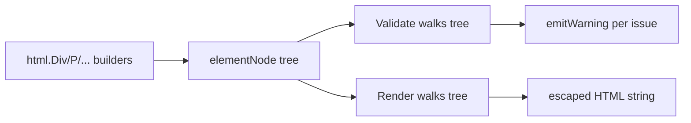

# Architecture

Part of [[Codebase Overview]].

## Node shape

One sealed interface carries the whole tree:

```go
type Node interface {
	renderNode(*renderer)
	validateNode(*validation, string)
}
```

Three concrete cases live in `node.go`/`script_code.go`/`unsafe_html.go`:
`textNode` (escaped text), `rawNode` (unescaped, `UnsafeHTML`), and
`elementNode` (tag + props + children). `Node` is sealed by the unexported
`renderNode`/`validateNode` methods — only files in `package html` can add a
new case.

> [!warning] This blocks a naive package split
> Every element constructor returns `elementNode{...}` directly — an
> unexported struct. Splitting the ~130 generated element files into a
> subpackage would require exporting `elementNode`'s fields, a public-API
> change, not a navigation cleanup. See [[Decisions Log#Why nothing here got split]].

## Render / validate pipeline



- `Render(n)` always runs `Validate(n)` first and emits every warning via
  the package-level `WarningHandler` (default: `log.Printf`) before writing
  any output — warnings never block rendering.
- `elementNode.validateNode` checks void-element-with-children, duplicate
  attributes, and duplicate `id` values in one tree walk.
- `renderer.text`/`raw` are the only two places bytes reach the output
  buffer un-mediated by tag structure — `text` HTML-escapes, `raw` doesn't
  (that's the whole contract behind `UnsafeHTML`).

## Attribute assembly

Every generated constructor funnels through one shared function,
`globalAttrs` (`common_props.go`) — the busiest node in the graph
(degree 137, see [[Decisions Log#graphify]]). It applies `id`/`class`/
`style`/`title` plus `customAttributes`, which regex-filters caller-supplied
`Attribute`s against a valid HTML attribute-name pattern before they reach
the tree.

## Generation

`cmd/htmlgen` (`cmd/htmlgen/main.go`) reads an `index.json` element schema
tree and writes one `<tag>.go` file per element it doesn't already find on
disk — it never overwrites an existing file, so hand-edits survive re-runs.
Generated files carry a `// Code generated by htmlgen; DO NOT EDIT.` header.
`script` is special-cased to `ScriptTag`/`script_tag.go` to avoid colliding
with `ScriptCode` (`script_code.go`), the hand-written raw-JS-body node.
